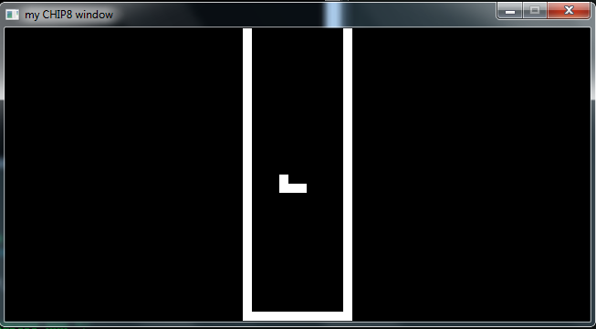
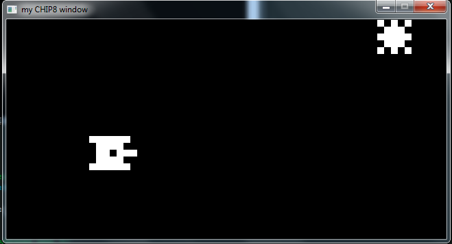
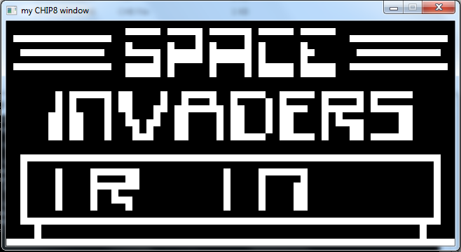

# OussChip8Emu
This is a simple emulator for chip8, That enables to play some classic games such as Tetris, Pong, Tank...
## Tetris

## Tank

## Invaders


## Compile
To Compile and run the program you need to install the SDL2 Development Libraries [here](https://www.libsdl.org/release/SDL2-devel-2.0.12-mingw.tar.gz) then extract it<br/>For the makefile to be compiled correctly please structure your folder as show in the following layout <br/>
```C
chip8Folder
+
|--makefile
|
+--bin
     \
     |--main.exe /*this file will be generated*/
     |--SDL2.dll /*copy tgis file from .\SDL2-2.0.12\x86_64-w64-mingw32\bin if you are on 64bit or .\SDL2-2.0.12\i686-w64-mingw32\bin if you are on 32bit */
+--build /* This folder contains all the generated object files */
     \
     |--chip8Core.o
     |--chip8delay.o
     |--chip8display.o
     |--chip8init.o
     |--chip8keyboard.o
     |--chip8memory.o
     |--chip8opcode.o
     |--chip8stack.o
+--include
     \
     |--chip8header.h
     |--SDL2
           \ /* Here Copy all the files from \SDL2-2.0.12\i686-w64-mingw32\include\SDL2 for 64bit or from \SDL2-2.0.12\i686-w64-mingw32\include\SDL2 for 32bit */
+--lib
     \ /* Here Copy all the files from \SDL2-2.0.12\i686-w64-mingw32\lib for 64bit or from \SDL2-2.0.12\i686-w64-mingw32\lib for 32bit */
+--src
     \
     |--chip8Core.c
     |--chip8display.c
     |--chip8keyboard.c
     |--chip8memory.c
     |--chip8opcode.c
     |--chip8stack.c
     |--main.c
```
Use the line commmand `cd` to change directory to where the `makefile` is located (chip8folder in the previous layout) then run the commmand `mingw32-make`<br/>
make sur that minGW toolchaine is installed in your computer
## Running
Change directory to `bin` and use the command `main ./nameOfChip8Game`
## ROM Games
You can check these ones [here](https://www.zophar.net/pdroms/chip8/chip-8-games-pack.html)<br/>
Have fun!!
